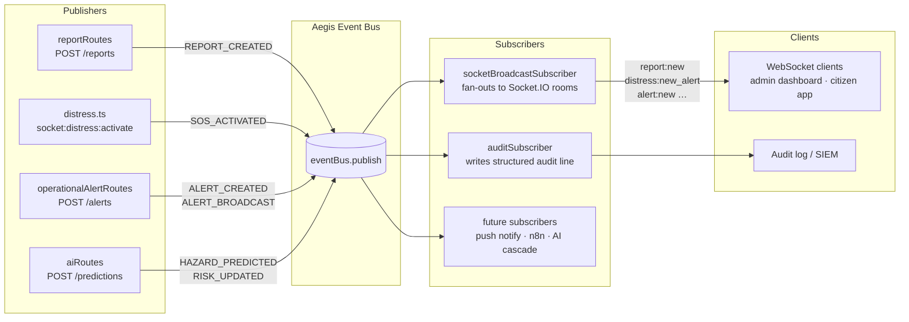

# AEGIS Architecture Overview

AEGIS (Adaptive Emergency and Geospatial Intelligence System) is a full-stack disaster-response platform. This document describes the codebase layout, data flows, and key architectural decisions.

---

## Repository Map

| Area | Path | Language | LOC | Notes |
|------|------|----------|-----|-------|
| Server (API) | `server/src/` | TypeScript | ~70 k | Express + Socket.IO |
| Client (SPA) | `client/src/` | TypeScript/React | ~106 k | Vite + Tailwind |
| AI Engine | `ai-engine/app/` | Python | ~34 k | FastAPI + scikit-learn/CatBoost |
| Prototype | `aegis-prototype/` | TypeScript/React | — | Throwaway UI experiments |

### Server sub-directories

| Sub-directory | Files | Responsibility |
|---------------|-------|----------------|
| `routes/` | 38 | HTTP endpoints (REST + multipart) |
| `services/` | — | Business logic, LLM chat, AI client, cache, notifications |
| `services/chatTools/` | 3 | LLM tool schemas + executor implementations (split from 2076-line monolith) |
| `services/socketHandlers/` | 5 | Socket.IO event handlers (split from socket.ts) |
| `events/` | 4 | Typed event bus, contracts, correlation context |
| `subscribers/` | 3 | Reactive subscribers (socket broadcast, audit log) |
| `middleware/` | — | Auth, rate-limit, response helpers, upload |
| `models/` | — | DB pool (pg), TypeORM entities |

### Client sub-directories

| Sub-directory | Notes |
|---------------|-------|
| `pages/` (27 files) | One file per route/view |
| `components/` (121 files) | Re-usable UI components |
| `contexts/` | React context providers (Reports, Auth, Socket, Alerts, …) |
| `hooks/` | Custom hooks (`useApiResource`, `useEventCallbacks`, `useAsync`) |
| `utils/` | `apiFetch`, date helpers, i18n |

---

## Event Bus Spine

All side-effects (socket broadcasts, audit logs, push notifications, AI cascades) are triggered through the **typed event bus** (`server/src/events/eventBus.ts`). Route handlers publish one event; subscribers react independently.



### Event catalogue (`server/src/events/eventTypes.ts`)

| Event name | Source | Socket channel emitted |
|------------|--------|------------------------|
| `report.created` | citizen | `report:new` (all clients, full row fetched from DB) |
| `report.updated` | operator | `report:updated` (all clients) |
| `report.assigned` | operator | `report:assigned` (admins room) |
| `report.resolved` | operator | `report:resolved` (all clients) |
| `sos.activated` | citizen | `distress:new_alert` + `distress:alarm` (admins room) |
| `alert.created` | operator | `alert:new` (all clients) |
| `alert.broadcast` | operator | `alert:broadcast` (all clients) |
| `alert.acknowledged` | operator | `alert:acknowledged` (admins room) |
| `alert.expired` | system | `alert:expired` (all clients) |
| `incident.escalated` | operator | `incident:escalated` (admins room) |
| `hazard.predicted` | ai-engine | `hazard:predicted` (all clients) |
| `risk.updated` | ai-engine | `risk:updated` (all clients) |

---

## Request Lifecycle

```
Browser/Mobile
   │
   │  HTTP/REST
   ▼
Express middleware stack
  ├─ rateLimiter
  ├─ authenticate (JWT)
  ├─ validateInput (Zod)
   │
   ▼
Route handler
  ├─ DB query (pg pool)
  ├─ eventBus.publish(typed event)
  └─ res.success(data)          ← responseHelpers.ts wrapper

                 │ async (AsyncLocalStorage correlation)
                 ▼
        socketBroadcastSubscriber  →  Socket.IO rooms
        auditSubscriber            →  audit log
        (future) notifySubscriber  →  push / SMS / e-mail
```

---

## AI Chat Architecture

```
chatService.ts
  ├─ chatConstants.ts  (region/LLM config)
  ├─ chatLiveContext.ts  (live DB context injected into system prompt)
  ├─ chatRag.ts  (vector similarity retrieval)
  ├─ chatCache.ts  (Redis query hash cache)
  └─ chatTools/
       ├─ schemas.ts     AVAILABLE_TOOLS + ADMIN_TOOLS definitions
       ├─ executors.ts   executeToolCall dispatcher + all handlers
       └─ index.ts       barrel re-export
```

LLM backends tried in order: Ollama (local) → OpenRouter (cloud, multiple models in parallel) → Gemini flash.

---

## Auth Model

| Role | JWT claim | Capabilities |
|------|-----------|--------------|
| citizen | `role: 'citizen'` | Submit reports, view public data, chat |
| operator | `role: 'operator'` | All citizen + triage reports, broadcast alerts, chat admin tools |
| admin | `role: 'admin'` | All operator + user management, AI governance, audit trail |

Tokens are RS256-signed, 15-minute access + 7-day refresh. Refresh tokens are stored in `refresh_tokens` table and rotated on each use.

---

## Infrastructure

```
docker-compose.yml
  ├─ postgres:16    (PostGIS enabled)
  ├─ redis:7        (cache + pub/sub)
  ├─ server         (Node 20 + Express)
  ├─ client         (nginx serving Vite build)
  └─ ai-engine      (Python + uvicorn)
```

All services communicate over the `aegis_network` Docker bridge. The server connects to Redis for caching and Socket.IO adapter for horizontal scaling.

---

## Key Files Quick-Reference

| File | Purpose |
|------|---------|
| `server/src/events/eventContracts.ts` | Typed payload shapes for every event |
| `server/src/events/eventBus.ts` | Thin facade over `eventStreaming` with correlation propagation |
| `server/src/subscribers/socketBroadcastSubscriber.ts` | All socket fan-out logic |
| `server/src/subscribers/auditSubscriber.ts` | All structured audit logging |
| `server/src/middleware/responseHelpers.ts` | `res.success()` / `res.fail()` envelope |
| `server/src/middleware/errorHandler.ts` | `AppError` → HTTP response mapping |
| `client/src/hooks/useApiResource.ts` | Declarative data-fetch hook (replaces raw `fetch`) |
| `client/src/hooks/useEventCallbacks.ts` | Typed socket event subscription hook |
| `client/src/utils/apiFetch.ts` | Authenticated fetch wrapper, parses `{ ok, data, error }` |
